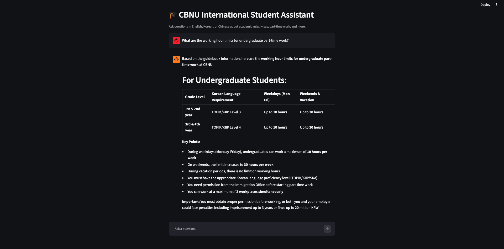
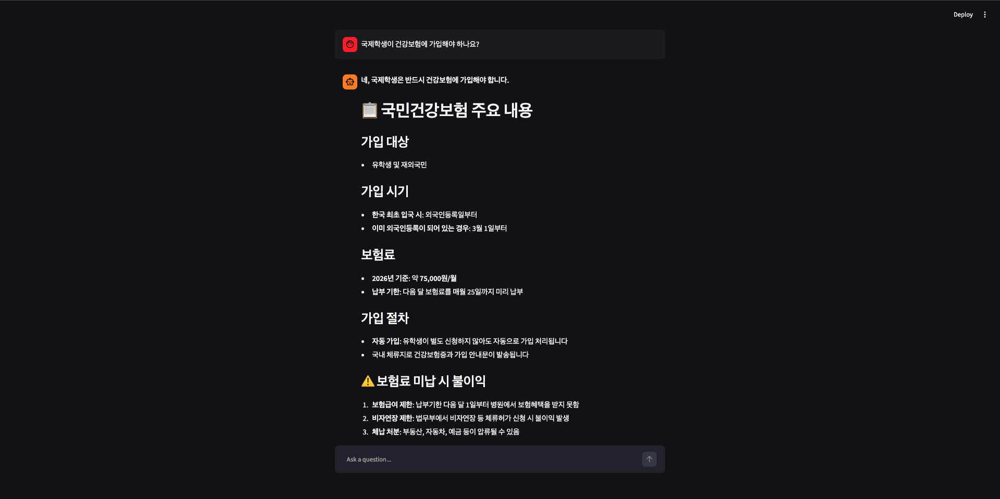
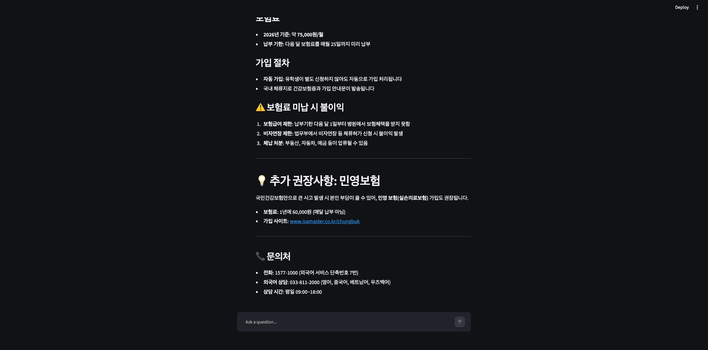

# 🎓 Agentic RAG Knowledge Assistant

Multilingual RAG + SQL + Web Search, orchestrated by a LangGraph agent


**🔗 Live Demo:** [Try it here](https://agentic-rag-cbnu.streamlit.app/)


---

## Overview

This project is an agentic knowledge assistant that answers questions in English, Korean, and Chinese by intelligently combining three information sources: a semantic document search (vector RAG), a structured FAQ lookup (SQL), and live web search. Instead of relying on a single retrieval method, a Claude-powered agent built with LangGraph decides which tool (or combination of tools) best answers each query, then synthesizes a grounded, cited response.

The system is demonstrated on a real-world corpus: Chungbuk National University's official trilingual guidebook for international students.

---

## Architecture

```
User query
    │
    ▼
Agent Orchestrator (Claude + LangGraph)
    │
    ├── search_guidebook  → Qdrant (bge-m3 embeddings)  — semantic search over guidebook PDFs
    ├── search_faq        → SQLite                       — quick lookup for common questions
    └── search_web        → DuckDuckGo                   — real-time information
    │
    ▼
Grounded, multilingual answer
```

The agent examines each query and autonomously selects the right tool(s) — often combining results from multiple sources into a single answer.

---

## Key Features

- **Multilingual by design** — handles English, Korean, and Chinese queries and responds in the same language as the question.
- **Multi-tool agent orchestration** — the agent plans and selects tools rather than following a fixed pipeline.
- **Grounded answers** — responses are built from retrieved source material, not model memory alone.
- **Hybrid retrieval** — combines semantic vector search with structured SQL lookups for speed and precision.
- **Chat interface** — a Streamlit front end for interactive testing and demos.

---

## Tools

### 1. Guidebook Search (Vector)
Semantic search over guidebook content, embedded with `multilingual-e5-small` (a multilingual embedding model) and stored in Qdrant. Chunking is section-based, preserving the document's original structure across all three languages.

### 2. FAQ Search (SQL)
A small SQLite-backed table of frequently asked questions, used for fast, direct answers to common queries before falling back to a full document search.

### 3. Web Search
Live web search (DuckDuckGo) for information not available in the guidebook — such as exchange rates or current events relevant to international students in Korea.

---

## Case Study: CBNU International Student Guidebook

The corpus used in this project is the official *2026 Guidebook for International Students*, published by Chungbuk National University's Office of International Affairs — available in English, Korean, and Chinese. This project is inspired by prior thesis research in multilingual chatbot systems, rebuilt here as a new, independent agentic architecture.

---

## Tech Stack

| Component | Technology |
|---|---|
| LLM | Claude (Anthropic API) |
| Agent orchestration | LangChain / LangGraph |
| Vector database | Qdrant (Docker) |
| Embedding model | multilingual-e5-small (local, multilingual) |
| Structured data | SQLite |
| Web search | DuckDuckGo (`ddgs`) |
| Frontend | Streamlit |

---

## Installation

### 1. Clone the repository
```bash
git clone https://github.com/zcelmuun/agentic-rag-knowledge-assistant.git
cd agentic-rag-knowledge-assistant
```

### 2. Set up a virtual environment
```bash
python3 -m venv venv
source venv/bin/activate
pip install -r requirements.txt
```

### 3. Set environment variables
Create a `.env` file in the project root:

ANTHROPIC_API_KEY=your_key_here
QDRANT_URL=your_qdrant_cloud_url
QDRANT_API_KEY=your_qdrant_api_key


### 4. Start Qdrant (via Docker)
```bash
docker run -d --name qdrant-container -p 6333:6333 -p 6334:6334 -v $(pwd)/qdrant_storage:/qdrant/storage qdrant/qdrant
```

### 5. Build the knowledge base
```bash
python3 src/ingestion/chunk_documents.py
python3 src/ingestion/create_collection.py
python3 src/ingestion/embed_and_upload.py
python3 src/sql_store/create_db.py
python3 src/sql_store/create_faq_table.py
```

### 6. Launch the chat interface
```bash
streamlit run app.py
```

---

## Screenshots

**English query — part-time work regulations:**


**Multilingual support — Korean query about health insurance:**

